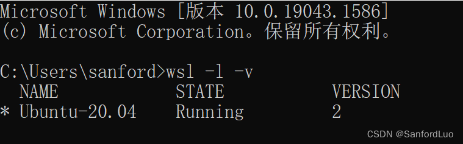
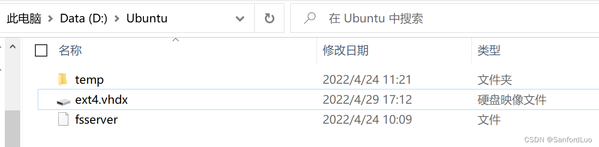
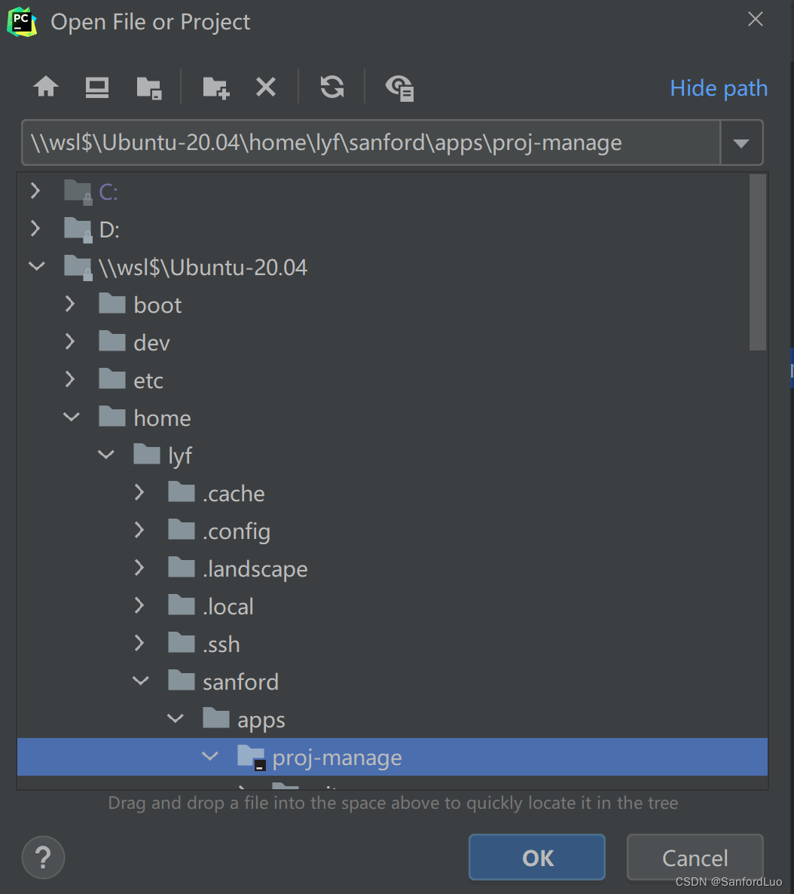
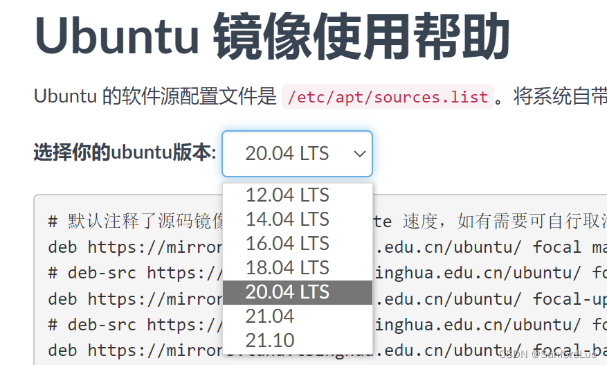
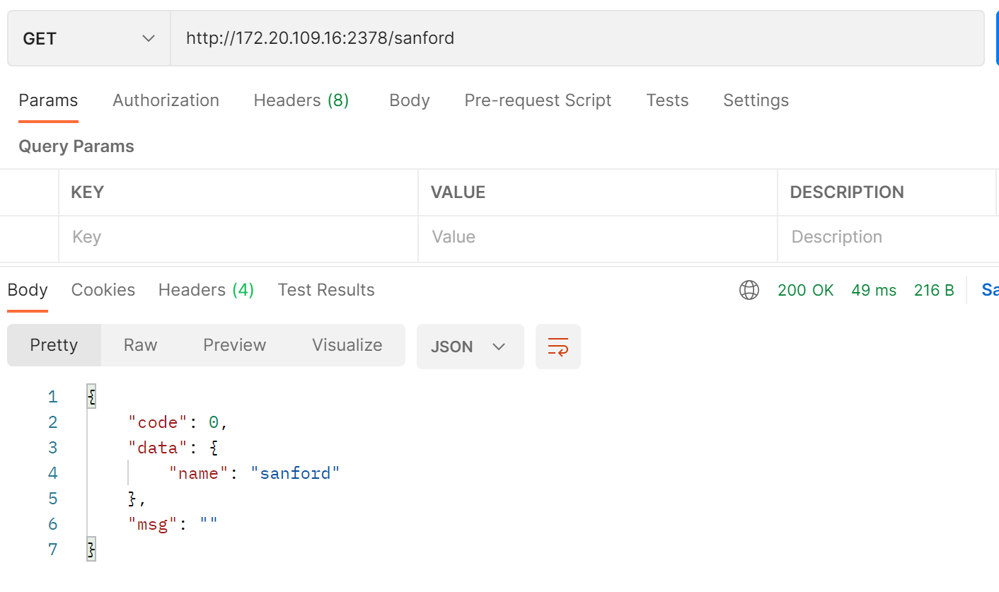
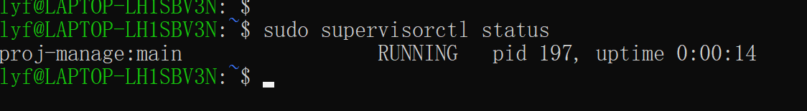
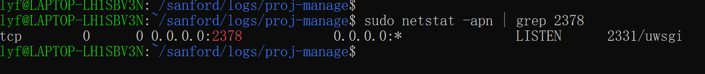
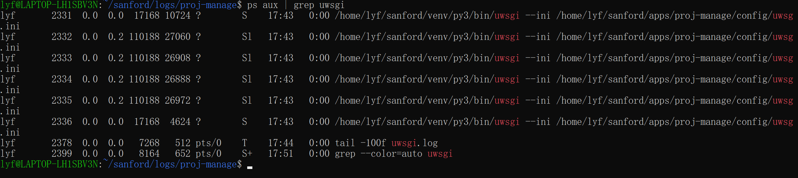
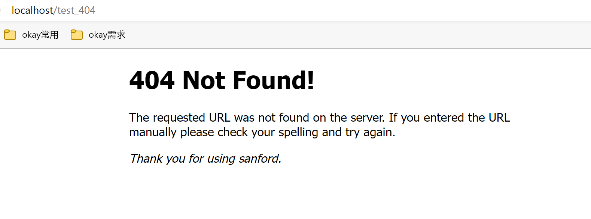
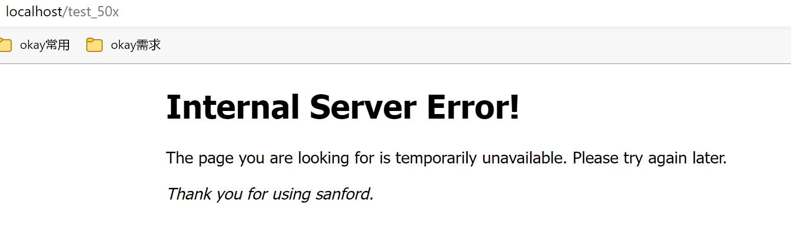

- [proj-manage](#proj-manage)
  - [本文说明](#本文说明)
  - [开发环境](#开发环境)
    - [wsl2配置](#wsl2配置)
    - [跨系统文件互传](#跨系统文件互传)
    - [LxRunOffline管理工具](#lxrunoffline管理工具)
    - [修改国内镜像](#修改国内镜像)
    - [virtualenvwrapper使用](#virtualenvwrapper使用)
  - [项目管理](#项目管理)
    - [相关命令](#相关命令)
    - [一般启动](#一般启动)
    - [supervisor使用](#supervisor使用)
    - [uwsgi使用](#uwsgi使用)
    - [nginx使用](#nginx使用)
      - [nginx监听5678端口转发到uwsgi服务的2378端口](#nginx监听5678端口转发到uwsgi服务的2378端口)
    - [docker使用](#docker使用)
# proj-manage

## 本文说明

项目管理相关  
开发语言：python  
开发环境：WSL2  
相关涉及：docker、supervisor、nginx、uwsgi、kafka

## 开发环境

### wsl2配置

wsl 是 win 自带的 Ubuntu 系统，各种安装教程随便搜到处都是。  
而 wsl2 相较于 wsl1 来说最大的一个区别就是 wsl2 有完整的 Linux 内核，wsl2 不再是文件夹形式存在于 win 盘中，而是会生成一个 ext4.vhdx 硬盘文件。  
我这里用 wsl2 最大的一个作用就是想直接用 docker，下面会说，还有一个优点是 win 与 wsl 文件互传更方便。

```

### 管理员权限下的 cmd 或 PowerShell

 
# 设置wsl版本为2
wsl --set-default-version 2
 
# 查询wsl版本
wsl -l -v
```





### 跨系统文件互传

相关命令行，知道下面两个命令就可以灵活的跨系统文件互传了。

```
# 在wsl中进入win中d盘中的PyProj
cd /mnt/d/PyProj/
 
# 在win中进入wsl中的root用户中
cd \\wsl$\Ubuntu-20.04\home\lyf\
```

另外 win 系统上的 ide 也可直接编辑wsl中的文件，简直太方便了。  



### LxRunOffline管理工具

用这东西主要是想把wsl安装的地址迁移一下，wsl默认是安装在c盘的。  
官方下载地址: [LxRunOffline](https://github.com/DDoSolitary/LxRunOffline/releases)  
直接下载 xxx-msvc.zip 格式就行。安装，然后加入系统环境变量。比如我的是 D:\AppData\LxRunOffline-v3.5.0-msvc

```

### LxRunOffline 常用命令

 
# 查看wsl版本
LxRunOffline list
 
# 移动（比如我的移动到指定位置 D:\Ubuntu）
LxRunOffline move -n Ubuntu-20.04 -d D:\Ubuntu
 
# 查看wsl的安装路径
LxRunOffline di -n Ubuntu-20.04
```

### 修改国内镜像

本文以国内清华源为主。清华源官网: [清华大学开源软件镜像站](https://mirrors.tuna.tsinghua.edu.cn/)  
常用的镜像：ubuntu，pypi，docker-ce

Ubuntu-20.04镜像: [Ubuntu 镜像使用帮助](https://mirrors.tuna.tsinghua.edu.cn/help/ubuntu/)  
选择适合的版本，按照使用说明操作就行。我这里是Ubuntu-20.04的  



PyPi镜像: [PyPi镜像说明](https://mirrors.tuna.tsinghua.edu.cn/help/pypi/)

```
# 命令行配置PyPi镜像
pip config set global.index-url https://pypi.tuna.tsinghua.edu.cn/simple
 
# 执行完成后会在用户目录下生成相应的pip配置文件
.config/
└── pip
    └── pip.conf
```

### virtualenvwrapper使用

virtualenvwrapper用于管理python的虚拟环境。

安装:

```
pip install virtualenv
pip install virtualenvwrapper
```

配置，在.bashrc文件里添加下面三行：vim .bashrc

```
# 安装的python路径，可用 `which python3` 查看
export VIRTUALENVWRAPPER_PYTHON=/usr/bin/python3
 
# 创建的虚拟环境存放的路径
export WORKON_HOME=$HOME/sanford/venv
 
#  用于激活virtualenvwrapper工具
source /usr/local/bin/virtualenvwrapper.sh
```

加载修改后的配置

```
source ~/.bashrc
```

相关命令:

```
# 指定py版本创建虚拟环境
mkvirtualenv -p python3 py3
 
# 查看所有虚拟环境
lsvirtualenv
 
# 进入虚拟环境
workon py3
 
# 退出虚拟环境
deactivate
 
# 删除虚拟环境
rmvirtualenv py3 
```

## 项目管理

### 相关命令

```
# 查看端口占用情况
netstat -apn | grep 2378

# 查看进程
ps aux | grep python

# 杀死进程
kill -9 pid

# 后台启动
nohup python3 main.py &
```

### 一般启动

执行main.py文件，或者将启动命令放入sh文件

```
/usr/bin/python3 /sanford/apps/proj-manage/main.py
```



### supervisor使用

安装：

```
apt-get install supervisor
```

配置文件说明：

```
/etc/supervisor/
├── conf.d
│   └── proj_manage_supvr.conf
└── supervisord.conf
```

supervisord.conf：全局的主要配置，默认不需要修改什么。需要关注的：logfile=/var/log/supervisor/supervisord.log；pidfile=/var/run/supervisord.pid  
conf.d：存放子进程配置文件的一个文件夹

proj_manage_supvr.conf：自定义的关于这个项目的配置文件  
示例：[proj_manage_supvr.conf](./config/proj_manage_supvr.conf)

```
# 组进程管理：组名
[group:proj-manage]
# 组进程包含的子进程名称，逗号隔开
programs = main

# 子进程管理：进程名
[program:main]
# 启动program的命令
command = /home/lyf/sanford/venv/py3/bin/python /home/lyf/sanford/apps/proj-manage/main.py
# 项目路径
directory = /home/lyf/sanford/apps/proj-manage
# 进程名表达式
process_name = %(program_name)s
# 用户名
user = lyf
# 在supervisord启动的时候自动启动进程
autostart = true
# 当进程在running状态下exit时自动重启
autorestart = true
# 失败重启次数，超过则会FATAL
startretries = 3
# 进程的标准错误输出内容会被写入supervisord的标准输出stdout_logfile里
redirect_stderr = true
# 日志文件
stdout_logfile = /home/lyf/sanford/logs/proj-manage/supvr-main.log
# 日志级别
loglevel = info

# 开启多进程时（注意端口冲突）
process_name=%(program_name)s_%(process_num)s
numprocs=4
```

相关命令：

```
# 启动supervisord
supervisord -c /etc/supervisor/supervisord.conf

# 停用
supervisorctl shutdown

# 查看所有服务
supervisorctl status

# 停用
supervisorctl stop aaa

# 启动
supervisorctl start aaa

# 重启
supervisorctl restart aaa

# 配置文件修改后重新加载
supervisorctl update

# 重新启动配置中的所有程序
supervisorctl reload

# 进入
supervisorctl -c /etc/supervisor/supervisord.conf
```



```
[2022-05-10 11:08:11,801] [INFO] [main.py:13] [77777] ===info===
[2022-05-10 11:08:11,801] [ERROR] [main.py:14] [77777] ===err===
[2022-05-10 11:08:11,801] [INFO] [_internal.py:224] [] 172.20.96.1 - - [10/May/2022 11:08:11] "GET /sanford HTTP/1.1" 200 -
```

### uwsgi使用

安装(我是安装在python虚拟环境里了)：

```
pip install uwsgi
```

ini配置文件说明：  
示例：[uwsgi.ini](./config/uwsgi.ini)

```
[uwsgi]
;指定ip端口
http = 0.0.0.0:2378
;用户名
uid = lyf
;用户组
gid = lyf
;项目目录
chdir = /home/lyf/sanford/apps/proj-manage
;python项目的启动文件
wsgi-file = /home/lyf/sanford/apps/proj-manage/main.py
;python应用的实例名称
callable = app
;启用主进程
master = true
;进程数，同workers
processes = 4
;每个进程的线程数
threads = 2
;启动多进程时一般配置，每个进程worker加载应用一次，不配置的话其他进程是通过fork来的
lazy-apps = true
;允许启动多线程
enable-threads = true
;如果没有可以加载的应用，则退出
need-app = true
;在每个请求上启用tcp nodelay
tcp-nodelay = true
;设置监听队列大小
listen = 128
;创建pid文件
pidfile = /home/lyf/sanford/proj-manage-uwsgi.pid
;log文件
logto = /home/lyf/sanford/logs/proj-manage/uwsgi.log
;log日志记录master进程
log-master = true
;日志文件最大大小
log-maxsize = 524288000
```

相关命令：

```
# 启动
/home/lyf/sanford/venv/py3/bin/uwsgi --ini /home/lyf/sanford/apps/proj-manage/config/uwsgi.ini

# 停止
/home/lyf/sanford/venv/py3/bin/uwsgi --stop /home/lyf/sanford/proj-manage-uwsgi.pid
```

加入supervisor管理：

```
command = /home/lyf/sanford/venv/py3/bin/uwsgi --ini /home/lyf/sanford/apps/proj-manage/config/uwsgi.ini
```

uwsgi.log日志内容：

```
[2022-05-10 17:45:03,184] [INFO] [main.py:13] [77777] ===info===
[2022-05-10 17:45:03,184] [ERROR] [main.py:14] [77777] ===err===
[pid: 2332|app: 0|req: 3/3] 172.20.96.1 () {38 vars in 509 bytes} [Tue May 10 17:45:03 2022] GET /sanford => generated 46 bytes in 0 msecs (HTTP/1.1 200) 2 headers in 71 bytes (1 switches on core 0)
```

查看端口占用情况，确认是uwsgi占用的：  



查看uwsgi进程：  



### nginx使用

安装：

```
sudo apt-get install nginx
```

相关文件说明：

```
/usr/sbin/nginx：主程序
/etc/nginx：存放配置文件
/usr/share/nginx：存放静态文件
/var/log/nginx：存放日志

# 主要配置文件说明
/etc/nginx/
├── conf.d  # 存放子配置文件的一个文件夹
│   └── proj_manage_nginx.conf  # 子配置文件示例
├── nginx.conf  # 全局的主配置文件
```

/etc/nginx/nginx.conf 一般配置及相关说明：[nginx.conf](./config/nginx.conf)  
/usr/share/nginx 下的静态文件示例：[index.html](./static/nginx_html/index.html), [404.html](./static/nginx_html/404.html), [50x.html](./static/nginx_html/50x.html)  
/etc/nginx/conf.d 下的子配置文件示例：[test_nginx.conf](./config/test_nginx.conf)

相关命令：

```
# 查看版本
nginx -v

# 启动nginx服务
nginx

# 重新载入配置并重启
nginx -s reload

# 检查配置文件
nginx -t

# 停止服务
nginx -s stop
```

测试index：http://localhost/  


测试404：http://localhost/test_404  



测试50x：http://localhost/test_50x  



测试子配置文件（监听的7777端口）：http://localhost:7777


#### nginx监听5678端口转发到uwsgi服务的2378端口

配置文件：[proj_manage_nginx.conf](./config/proj_manage_nginx.conf)  
启动 uwsgi、nginx  
访问：http://localhost:5678/sanford

### docker使用
